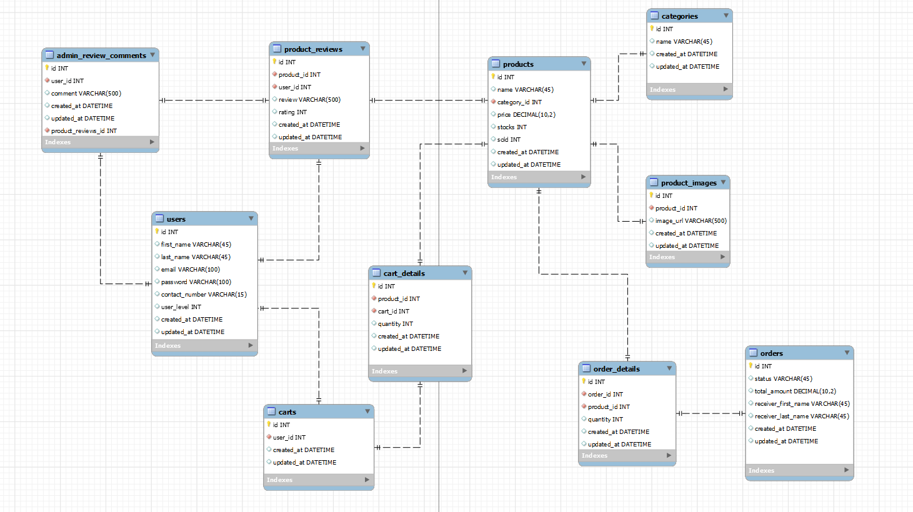

# PHP-Ecommerce-Project
This repository contains the source code for an e-commerce website built with PHP. It includes frontend and backend components, implemented with HTML, CSS, JavaScript, Bootstrap, and CodeIgniter3 framework. The project showcases web development skills, database design, and best practices for building an online shopping platform.

## Entity Relationship Diagram (ERD)

## Video Demonstration

## Author/s

Contributor/s names and contact info:

Dhanco Mendoza [@dhnxx](https://github.com/dhnxx)

